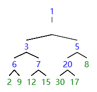

# exercise 12.1 ~ 12.18

## 12.6

1) 

2) 

数组:
> 30 20 17 12 15 8 2 9 7 3 5 6  

树:
> 30 
20 17 
12 15 8 2 
9 7 3 5 6  

3) 

插入15:
> 30 
20 17 
12 15 15 2 
9 7 3 5 6 8 

插入20:
> 30 
20 20 
12 15 15 17 
9 7 3 5 6 8 2 

插入45:
> 45 
20 30 
12 15 15 20 
9 7 3 5 6 8 2 17

4) 
pop(): 
>30 
20 20 
12 15 15 17 
9 7 3 5 6 8 2 

pop():
>20 
15 20 
12 5 15 17 
9 7 3 2 6 8 

pop():
>20 
15 17 
12 5 15 8 
9 7 3 2 6  

pop():
>17 
15 15 
12 5 6 8 
9 7 3 2